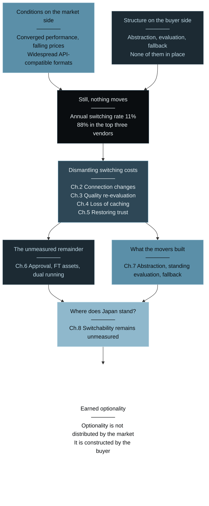
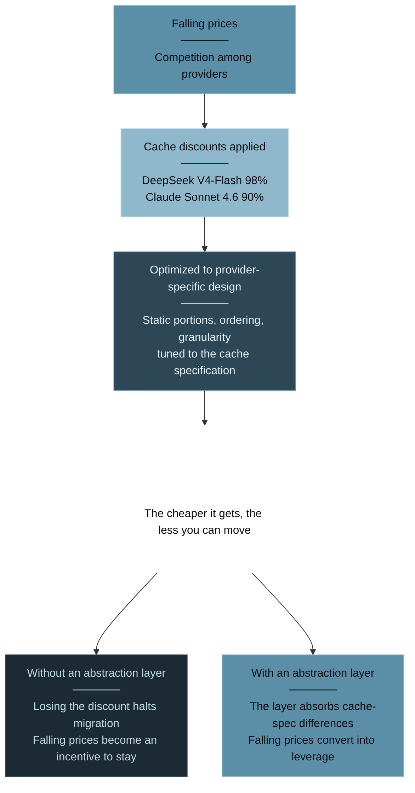
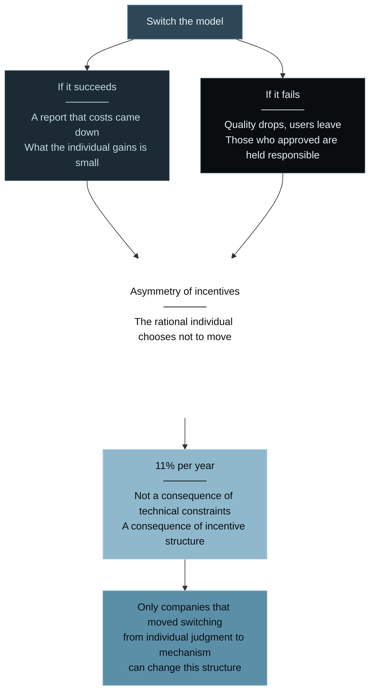
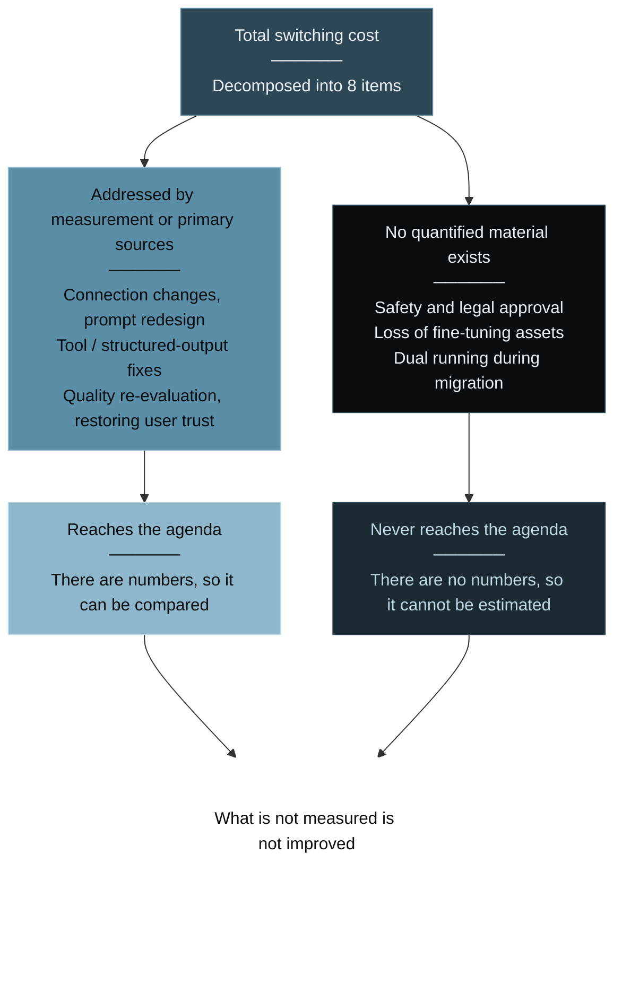
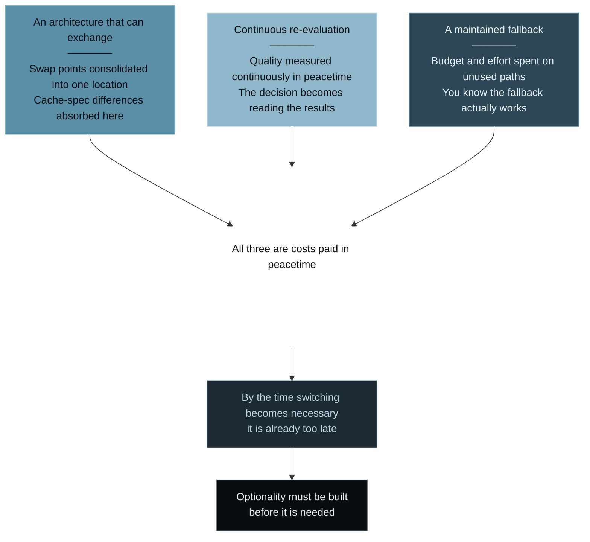
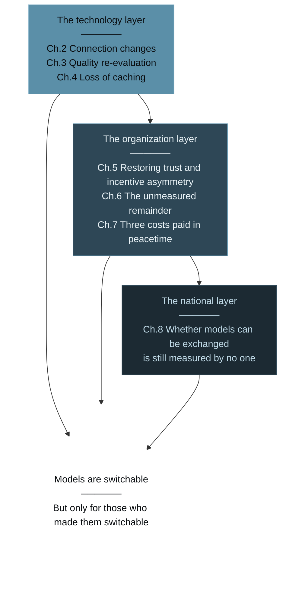

# Earned AI Model Optionality — AI Models Are Switchable. But Only for Companies That Made Them So.

> **"AI models are switchable. But only for companies that made them switchable."**

[](https://creativecommons.org/licenses/by/4.0/)
[](https://github.com/Leading-AI-IO/earned-ai-model-optionality)


<br/>

---

# Prologue: They Were Supposed to Be Switchable

Airbnb uses Alibaba's Qwen for customer service.<br/>
CEO Brian Chesky explained the reason as "fast and cheap."<br/>
Anysphere, the company behind Cursor, was reported to have adopted Moonshot AI's Kimi family as the foundation for its Composer models.<br/>
Companies have emerged that switched from Claude to other vendors' models, anticipating savings in the millions of dollars.

**The models were switched.**

The U.S. Congress did not overlook this.<br/>
House committees opened an investigation into Airbnb and Cursor's parent company regarding their use of Chinese-origin models.<br/>
It was precisely because switching happened that regulators moved.

Up to this point, the story is well known.<br/>
"AI models have been commoditized." "The age of the buyer has arrived." These conclusions are being repeated everywhere.

Yet in that same year, 2026, Menlo Ventures reported something entirely different.

**Switching between vendors is relatively easy, but it is becoming increasingly rare.**

The annual switching rate is **11%**.<br/>
And **88%** of enterprise LLM API usage is concentrated in three companies: OpenAI, Anthropic, and Google.

What is supposed to be switchable is not being switched.<br/>
This book begins from that contradiction.

## "Easy but Rare" Is Not a Contradiction

At first glance, Menlo's description looks self-contradictory.<br/>
If it is easy, why is it rare?

But it is not a contradiction. **What "easy" refers to is simply narrower than it appears.**

Rewriting an API endpoint is indeed easy.<br/>
Many model providers have adopted the OpenAI-compatible format, and changing a few lines of SDK initialization parameters is enough to route requests to a different model.<br/>
Viewed from that angle alone, switching is a one-day task.

But the measured experience of Lindy, which builds an AI agent platform, shows an entirely different landscape.<br/>
Evaluation alone took **six to nine months**.<br/>
The effort the actual migration required was **100 times the initial estimate**.

An engineer at the company put it this way:

> **Changing the model name was easy. The work was proving that users would still trust it.**

That single sentence summarizes this entire book.<br/>
What gets switched is not a model name. **It is everything that has been built on top of the model in the form of trust.**

## What This Book Means by "Earned Optionality"

The proposition that "AI models have been commoditized" is only half correct.

Performance has converged. Prices continue to fall. API-compatible formats have been widely adopted.<br/>
**The conditions on the market side are, indeed, in place.**

Yet only a small minority of companies convert those conditions into bargaining power.<br/>
The figure of 11% per year shows exactly that.

This book captures that state in a single term: **Earned Optionality**.

Earned optionality refers to **the condition in which the possibility of switching models exists in the market, yet the ability to actually exercise it is limited to companies that have themselves built a switchable structure**.<br/>
Optionality is not distributed by the market. It is constructed by the buyer.

Why use this term rather than existing phrases such as "multi-model operations" or "avoiding vendor lock-in"?<br/>
Because as long as this discussion is framed as a binary—locked in or not locked in—**we will permanently misplace where responsibility lies**.

Lock-in is assumed to be something vendors impose.<br/>
What this book shows is the opposite.<br/>
**Most companies that cannot move are companies that never made themselves able to move.**

| | "Commoditization" as conventionally described | Earned optionality (this book's observation) |
|---|---|---|
| Difficulty of switching | Easy, because APIs are compatible | Connection is easy. Evaluation, trust, and approval are not |
| Frequency of switching | Buyers move when there is a price gap | 11% per year. The driver is performance, not price |
| Market concentration | Dispersion is advancing | 88% in the top three vendors |
| Benefit of falling prices | All buyers enjoy it | Only buyers with switching capability convert it into leverage |
| Cause of lock-in | Vendor enclosure | The buyer never designed for switchability |

## Who This Book Is For, and Its Map

This book is written for three kinds of readers.

* First, **heads of IT and AI strategy who are being asked, "AI costs keep rising. Can't we move to a cheaper model?"**
Whether you can move is determined not on the model side but on your own. This book shows that structure.

* Second, **business owners and engineers who ship products with AI embedded in them**.
The cost of model migration is not rewriting a connection. It is re-proving trust. This book decomposes that total.

* Third, **anyone who wants to understand the dynamics of the AI industry as a structure rather than as a price list**.
What is happening in a market where prices are falling and buyers still do not move?

The map of this book is as follows.<br/>
First, we establish the fact that the market is not moving (Chapter 1).<br/>
Next, we dismantle switching costs one at a time.<br/>
Where does interface compatibility break (Chapter 2), what does re-evaluating quality require (Chapter 3),<br/>
why do falling prices produce lock-in (Chapter 4), and what is the heaviest cost of all—re-proving trust (Chapter 5)?<br/>
We then show that the remaining costs have been measured by no one (Chapter 6),<br/>
and look at what the companies that can still move actually built (Chapter 7).<br/>
Finally, we ask where Japanese companies stand in relation to this question (Chapter 8).

Costs shift layers: from technology to organization, from organization to nation.<br/>
But at every layer, the same proposition repeats.<br/>
**Models are switchable. But only for those who made them switchable.**

Let us lay out the path this book follows on a single diagram.



The side where conditions are in place is bright; the side where they are not remains dark.<br/>
And every path converges on a single point.

### References

1. Menlo Ventures, "2025 Mid-Year LLM Market Update" (July 31, 2025) — 11% annual switching rate / 88% in the top three vendors / "relatively easy to switch, but increasingly rare"<br/>https://menlovc.com/perspective/2025-mid-year-llm-market-update/
2. Lindy, "Migrating from Claude to DeepSeek" (June 24, 2026) — 6–9 months of evaluation / migration effort 100× the estimate / engineer testimony<br/>https://www.lindy.ai/blog/migrating-from-claude-to-deepseek
3. Semafor, "Exclusive: House committees probe Cursor parent, Airbnb over Chinese AI" (April 29, 2026)<br/>https://www.semafor.com/article/04/29/2026/house-committee-probes-cursor-parent-airbnb-over-chinese-ai
4. CNBC, "Chinese AI models costs US OpenAI Anthropic" (July 7, 2026)<br/>https://www.cnbc.com/2026/07/07/chinese-ai-models-costs-us-openai-anthropic.html

<br/>

---

# Chapter 1: 88% Are Not Moving

"AI models have been commoditized."<br/>
In 2026, this sentence is treated almost as a premise.

A commodity is a good whose supplier can be swapped without inconveniencing the buyer.<br/>
Oil, wheat, memory chips—suppliers change. That is why price is set by competition.

So has this actually become true of AI models?<br/>
There is only one way to check. **Look at whether buyers are actually swapping them.**

## The Market Did Not Move on Price

According to Menlo Ventures, the share of enterprises that switch LLM vendors is **11% per year**.<br/>
Nine out of ten companies stay with the same vendor for a full year.

And **88%** of enterprise LLM API usage is held by three companies: OpenAI, Anthropic, and Google.<br/>
The number of options keeps growing, yet actual usage remains concentrated in three vendors.

More important still is the reason switching occurs when it does.<br/>
Menlo states explicitly that what drives switching is **performance, not price**.

This collides head-on with the definition of a commodity market.<br/>
If it were a commodity, price would be the deciding factor.<br/>
**As long as selection is driven by performance, it is not yet a commodity.**

## Prices Really Are Falling

At the same time, it is not as if prices have failed to fall.

API prices for major models have declined continuously, and caching mechanisms deliver dramatic discounts.<br/>
DeepSeek V4-Flash offers a **98% discount** on cache hits; Claude Sonnet 4.6 offers **90%**.<br/>
Press reporting places the price gap between Chinese and U.S. models at 60–90%.

**The price conditions are in place. And still the market does not move.**

Here is the whole of the question this book addresses.<br/>
A price gap exists, compatible APIs exist, and switching is assessed as "relatively easy."<br/>
Yet only 11% move in a year.

**The reason they do not move is not on the market side.**

## "Companies That Can Move" and "Companies That Cannot" Are in Different Markets

The figure of 11% is an average.<br/>
Averages frequently hide structure.

Airbnb moved. Cursor moved. So did the companies that migrated off Claude and saved millions of dollars.<br/>
Meanwhile, 89% did not.

The same market. The same price lists. The same compatible APIs.<br/>
And still one side moves and the other does not.<br/>
**The difference is not on the model side. It is on the buyer side.**

The remaining chapters of this book dismantle, one at a time, what that difference is made of.<br/>
And at the end, we show what the companies that can move had already built.

### References

1. Menlo Ventures, "2025 Mid-Year LLM Market Update" (July 31, 2025) — 11% annual switching rate / 88% in the top three vendors / performance, not price, drives switching<br/>https://menlovc.com/perspective/2025-mid-year-llm-market-update/
2. DeepSeek, "Models & Pricing" — 98% discount on V4-Flash cache hits<br/>https://api-docs.deepseek.com/quick_start/pricing/
3. Anthropic, "Pricing" (Claude Platform Docs) — Claude Sonnet 4.6 prompt-cache reads are priced at 0.1× the base input rate ($3/MTok → $0.30/MTok), a 90% discount<br/>https://platform.claude.com/docs/en/about-claude/pricing
4. CNBC, "Chinese AI models costs US OpenAI Anthropic" (July 7, 2026) — the price advantage of Chinese models<br/>https://www.cnbc.com/2026/07/07/chinese-ai-models-costs-us-openai-anthropic.html

<br/>

---

# Chapter 2: It Says Compatible. It Is Not Compatible.

The right way to decompose switching costs is to start at the most superficial layer.<br/>
That is the connection itself.

This is the area everyone assumes is easy.<br/>
And in fact, **most of it is easy.** The problem is that the part which is not easy cannot be seen in advance.

## OpenAI Compatibility Is Not a Contract

Many model providers advertise an "OpenAI-compatible API."<br/>
The promise is that by matching request and response schemas to OpenAI's, existing SDKs and toolchains can be used as they are.

But this "compatibility" is not a specification defined by a standards body.<br/>
**Each vendor simply declares, of its own accord, that it has matched them.**

Consequently, both the range of what matches and the points where it diverges differ by provider.<br/>
And divergence does not surface as a failure to run.<br/>
**It surfaces as running, but returning different results.**

## The Divergences Are Documented Concretely

This is not an abstraction.<br/>
The public issues of LiteLLM—a library that unifies multiple model providers behind a single interface—record concrete breaks in compatibility.

* **Tool calls silently dropped** (issue #17246)<br/>
Tools are passed to the model, yet a response returns without the call ever being executed. No error is raised.

* **400 errors from missing `thinking_blocks`** (issue #7292)<br/>
Fields that preserve the reasoning trace are lost in cross-provider translation, and the request is rejected.

* **Corruption of structured image content** (issue #17762)<br/>
The structure of multimodal input breaks during conversion.

Each of these is the kind of failure you cannot notice at the moment you swap the model.<br/>
**Tests pass, deployment succeeds, and only afterward do you notice the behavior has changed.**

## "It Runs" and "It Runs the Same" Are Different

The cost of changing a connection is underestimated **because it is verified by asking whether it runs**.

Change the endpoint, get a 200 back, and the migration looks complete.<br/>
But what actually has to be confirmed is **whether the same input returns output of the same practical quality**.

And that is not a connection problem. It is a quality problem.<br/>
The next chapter examines that cost.

One thing should be settled here.<br/>
**Changing a connection is easy, but the scope of that ease extends only to "it connects," never to "it is the same."**

### References

1. LiteLLM official documentation, "Reasoning Content" — known constraints on cross-provider compatibility (including 400 errors from missing `thinking_blocks`)<br/>https://docs.litellm.ai/docs/reasoning_content
2. LiteLLM GitHub issue #17246 — tool calls silently dropped<br/>https://github.com/BerriAI/litellm/issues/17246
3. LiteLLM GitHub issue #7292 — function calling against o1 models fails with `UnsupportedParamsError`<br/>https://github.com/BerriAI/litellm/issues/7292
4. LiteLLM GitHub issue #17762 — corruption of structured image content<br/>https://github.com/BerriAI/litellm/issues/17762

<br/>

---

# Chapter 3: Six Months, and 100× the Effort

Once the connection is done, the real work begins.<br/>
**Re-evaluating quality.**

## The Actual Duration Lindy Measured

Lindy, which builds an AI agent platform, has published measured figures for a model migration.

**Six to nine months for evaluation alone.**<br/>
**Effort required for the actual migration: 100 times the initial estimate.**

These numbers are a single case at a single company.<br/>
They carry no statistical representativeness. But **published cases that disclose the cost of model migration in both duration and effort are themselves rare**, and in that sense this is valuable primary information.

Why does it take that long?

## Re-evaluation Is Not Benchmarking

When people hear "evaluate a model," most picture comparing public benchmark scores.<br/>
But re-evaluation in practice is an entirely different exercise.

What public benchmarks answer is, "Is this model generally intelligent?"<br/>
What practice must answer is, "**Does this model meet our standard, on our workload?**"

Answering the latter requires having a standard of your own.<br/>
What counts as correct? Which errors are tolerable, and which are fatal?<br/>
If that standard is not written down, comparison cannot even be constructed.

**This is the first reason many companies cannot switch models.**<br/>
They cannot compare because they hold no yardstick.<br/>
Without a yardstick, continuing with the incumbent model becomes the only safe choice.

## Prompts Are Optimized to a Model

The other burden is the prompt asset.

Prompts in production have been tuned to the quirks of one specific model.<br/>
The ordering of instructions, the number of examples, the way output formats are specified.<br/>
These reached their current form through trial and error, and **that tuning is model-specific.**

Hand the same prompt to a different model and, in most cases, quality drops.<br/>
Recovering the lost quality requires tuning again.<br/>
And evaluating the results of that tuning requires, once again, a standard.

**Prompt redesign and quality re-evaluation cannot be separated.**<br/>
The structure makes it impossible to finish only one of them.

## What "Switching on Performance" Means

As established in Chapter 1, Menlo reports that what drives switching is performance, not price.

That fact is consistent with this chapter.<br/>
**If re-evaluation takes six to nine months, a price gap alone cannot pay for it.**

For a company whose annual API spend is in the low millions of yen, six months of evaluation labor exceeds the price gap.<br/>
Price becomes a motive only for companies whose spend is large enough *and* whose evaluation machinery already exists.

So the market moves only when performance clearly improves.<br/>
**Price elasticity is not low. The fixed cost of possessing price elasticity is high.**

### References

1. Lindy, "Migrating from Claude to DeepSeek" (June 24, 2026) — 6–9 months of evaluation / migration effort 100× the estimate<br/>https://www.lindy.ai/blog/migrating-from-claude-to-deepseek
2. Menlo Ventures, "2025 Mid-Year LLM Market Update" (July 31, 2025) — performance, not price, drives switching<br/>https://menlovc.com/perspective/2025-mid-year-llm-market-update/

<br/>

---

# Chapter 4: The Cheaper It Gets, the Less You Can Move

Falling prices work in the buyer's favor.<br/>
That is economic common sense, and this book's core proposition initially rested on that premise too.

But in the AI model market, there exists a path where it does not hold.

## What the Cache Discount Actually Is

Major model providers offer prompt-caching mechanisms.<br/>
When identical input is sent repeatedly, the processed result for that portion is reused and a far lower unit price applies.

The discount rates are dramatic.<br/>
DeepSeek V4-Flash: **98% off** on a cache hit.<br/>
Claude Sonnet 4.6: **90% off**.

In agentic workloads, system prompts and reference documents are frequently identical on every call.<br/>
Cache hit rates therefore run high, and the effective unit price falls far below list.

**For the buyer, this is a pure gain.** At least in the short term.

## A Warm Cache Cannot Be Carried Out

The problem is that caching is **specific to each provider**.

A configuration that keeps a cache warm on one model starts from zero the moment it moves to another.<br/>
Immediately after migration, the uncached unit price applies.<br/>
In other words, **costs go up at the start of a migration.**

And cache optimization is not simply a matter of switching the mechanism on.<br/>
How much to fix as the static portion, in what order to assemble it, at what granularity to split it.<br/>
**All of these design decisions depend on each provider's cache specification.**

The more a company enjoys a 98% discount, the higher the bar for a migration that forfeits it.

## Falling Prices Become the Funding for Lock-In

Here is the inversion.

Falling prices were supposed to raise the buyer's leverage.<br/>
But when the bulk of the discount comes from caching, **that discount is tied to one specific provider.**

A general price cut is something the buyer can carry anywhere.<br/>
A cache discount cannot be carried at all.

**The cheaper it gets, the less you can move.**

This is not a conspiracy on the provider's part.<br/>
Caching is a rational economy of compute, and reflecting that benefit in price is a natural design.<br/>
But the result is that **a structure has formed in which the further price competition advances, the stronger lock-in becomes.**

Let us lay out this inversion on a single diagram.



The same discount acts in opposite directions depending on whether abstraction exists.

## One Condition for Leverage Is Settled Here

The conclusion this chapter yields is clear.

The only companies that can convert falling prices into leverage are **those that have abstracted cache design away from any single provider**.<br/>
For everyone else, falling prices act not as a bargaining chip but as **an incentive to maintain the status quo**.

The "companies that can choose" we examine in Chapter 7 all hold this layer themselves, without exception.

### References

1. DeepSeek, "Models & Pricing" — 98% discount on V4-Flash cache hits<br/>https://api-docs.deepseek.com/quick_start/pricing/
2. Anthropic, "Pricing" (Claude Platform Docs) — Claude Sonnet 4.6 prompt-cache reads are priced at 0.1× the base input rate ($3/MTok → $0.30/MTok), a 90% discount<br/>https://platform.claude.com/docs/en/about-claude/pricing

<br/>

---

# Chapter 5: The Work of Proving That Users Still Trust It

The four preceding chapters examined costs of technology and price.<br/>
But the largest cost the measurements reveal is not there.

Let us place the Lindy engineer's words once more.

> **Changing the model name was easy. The work was proving that users would still trust it.**

## Trust Resides in the Product, Not the Model

Users do not know which model a company is using.<br/>
Nor do they need to. What users evaluate is only the behavior of the product in front of them.

That product has been tuned over time on top of one specific model.<br/>
How it answers which questions. Where it refuses. What tone it speaks in.<br/>
All of these are **the result of design premised on the incumbent model's behavior**.

Swap the model, and the whole of this wavers.<br/>
Even at equivalent benchmark scores, **being equivalent and users feeling it is the same are different things.**

## The Party You Must Convince Is Also Internal

Re-proving trust is not work directed only at users.

At many companies, the quality of an AI product is approved by multiple departments.<br/>
Legal, security, compliance, customer support.<br/>
The incumbent model has already cleared those approvals.

Changing the model means **obtaining all of those approvals again.**

And those approvals do not pass on technical equivalence alone.<br/>
"Why change?" "What improves by changing?" "How do we roll back if it degrades?"<br/>
The responsibility for answering falls on whoever proposed the switch.

**The cost of switching includes the cost of accountability.**

## The Asymmetry of Incentives

From here, the core reason the market does not move comes into view.

**Switch models successfully, and the person responsible gains little.**<br/>
A report goes up saying costs came down. That is all.

**Fail, and what is lost is large.**<br/>
Quality drops, users leave, and the people who pushed the approval through are held responsible.

Under this asymmetry, the rational individual chooses not to move.<br/>
Even with a price gap of tens of percent, they do not move.

**The figure of 11% per year is not a consequence of technical constraints. It is a consequence of incentive structure.**

And the only companies that can change this structure are **those that have made switching a mechanism rather than an individual's judgment**.

Let us lay out this structure on a single diagram.



The smallness of the reward and the weight of the responsibility hang from the same single decision.

### References

1. Lindy, "Migrating from Claude to DeepSeek" (June 24, 2026) — engineer testimony: "Changing the model name was easy. The work was proving that users would still trust it."<br/>https://www.lindy.ai/blog/migrating-from-claude-to-deepseek
2. Menlo Ventures, "2025 Mid-Year LLM Market Update" (July 31, 2025) — 11% annual switching rate<br/>https://menlovc.com/perspective/2025-mid-year-llm-market-update/

<br/>

---

# Chapter 6: Nobody Has Measured the Remaining Costs

This book decomposes the total cost of switching as follows.

```
Total switching cost = connection changes + prompt redesign + tool / structured-output fixes
                     + quality re-evaluation + safety and legal approval
                     + loss of caching / fine-tuning
                     + restoring user trust + dual running during migration
```

Chapters 2 through 5 addressed five of these items through measurement or primary sources.<br/>
About the remaining three—**safety and legal approval, loss of fine-tuning assets, and dual running during migration**—this chapter must be honest.

**No material quantifying them could be found.**

Let us separate what could be measured from what could not.



A blank does not mean the cost is small. It means it has not been estimated.

## Three Engines Reported the Same Blank

The research for this book gave identical instructions to three research engines—Claude, ChatGPT, and Gemini—and ran them independently.<br/>
Their answers were then cross-checked.

All three, independently, reported nearly the same blank.

* **Claude**: Material systematically treating "model selection" as a distinct organizational capability is scarce.
* **ChatGPT**: No representative material was found that measures "candidate discovery → testing → safety approval → price negotiation → routing → re-evaluation → exit" as a single organizational capability.
* **Gemini**: No standardization document existed for how IT or procurement departments translate AI models into an RFP.

This is not the kind of absence that can be dismissed as "we searched badly."<br/>
**Three engines searched along separate paths and reported that the same place was empty.**

## What Does the Absence Mean?

AI model procurement already represents annual spending in the tens to hundreds of millions of yen at many companies.<br/>
Against spending of that magnitude, **no standard procedure exists for selection, evaluation, or exit.**

Consider the comparison.<br/>
Cloud infrastructure procurement has standard evaluation axes.<br/>
SaaS selection has comparison matrices and RFP templates.<br/>
Hiring has evaluation criteria and interview processes.

**Only AI models have none of it.**

Because there is none, each company judges individually.<br/>
Because judgment is individual, its quality does not accumulate as organizational capability.<br/>
Because nothing accumulates, the next switch costs the same all over again.

## What Is Not Measured Is Not Improved

The conclusion of this chapter is modest but important.

**There is no evidence that the three remaining cost items are small. It is more likely that they are simply unmeasured.**

Safety and legal approval, as Chapter 5 showed, can be the hardest gate in practice.<br/>
For a company running a fine-tuned model, losing that asset can be reason enough to abort a migration.<br/>
A period of dual running translates directly into double-counted cost.

Practitioners know all of this from experience.<br/>
But **knowing something and having it measured are different.**

What is not measured does not reach the executive agenda.<br/>
What does not reach the agenda does not become an object of investment decisions.<br/>
**This blank itself constitutes part of the reason so many companies cannot move.**

### References

1. Original research for this book (July 2026; cross-check of independent investigations by Claude / ChatGPT / Gemini) — the blank reported independently by three engines<br/>(no public URL; original research)
2. Original research for this book (July 2026; ChatGPT research response) — the decomposition formula for total switching cost<br/>(no public URL; original research)

<br/>

---

# Chapter 7: What Did the Companies That Can Choose Actually Build?

Eleven percent moved.<br/>
This chapter looks at what that 11% had.

The concluding section of the research states it this way.

> **Only companies that hold an architecture in which models can be exchanged, that continue re-evaluating, and that maintain multiple fallbacks can convert falling model prices into bargaining power. Ease of switching is not an attribute of the market as a whole; it is an organizational and technical capability the buyer builds.**

Let us decompose that sentence into three components.

## First, an Architecture That Can Exchange

An application that calls a model directly cannot be switched.<br/>
If call sites are scattered across the codebase, the surface to be changed cannot even be identified.

Companies that can move **isolate model calls behind an abstraction layer.**<br/>
A gateway, a router, or a thin in-house wrapper. The form does not matter.<br/>
What matters is that **the place where a model is swapped is consolidated into one location.**

And this layer also absorbs the cache design examined in Chapter 4.<br/>
By having the layer take on differences between providers' cache specifications, the application above it is unaffected.

**For a company without this layer, switching is a full rebuild. For a company with it, switching is a configuration change.**

## Second, Continuous Re-evaluation

As Chapter 3 showed, re-evaluation requires a standard of your own.<br/>
And a standard cannot be created once it is needed.

Companies that can move **measure the quality of the incumbent model continuously, in peacetime.**<br/>
They have evaluation datasets, pass/fail thresholds, and a mechanism that runs on a schedule.

Because they measure in peacetime, they can compare when a new model appears.<br/>
Because they can compare, the decision takes weeks.

**It takes six to nine months because evaluation is started immediately before a switch.**<br/>
Where evaluation is permanently in place, the switching decision becomes the work of reading the results.

## Third, a Maintained Fallback

The third is the most easily overlooked.

Companies that can move **maintain a live path to models they are not using.**<br/>
They route a fraction of production traffic, or verify connectivity on a schedule.

Maintaining this costs money.<br/>
Spending budget and effort on something unused is, in the short term, waste.

But that waste is the substance of leverage.<br/>
**Only a company that knows its fallback actually works can bring a real alternative to a negotiation with its incumbent vendor.**

A company whose fallback is merely "theoretically migratable" brings nothing to the table.<br/>
And the other side knows it.

## The Three Are Saying One Thing

An abstraction layer, standing evaluation, a maintained fallback.<br/>
All three are **costs paid in peacetime.**

By the time switching becomes necessary, it is already too late.<br/>
**Optionality must be built before it is needed.**

Let us lay out the relationship among the three on a single diagram.



All three are expenditures that look like waste for as long as you do not switch.

This is what "earned optionality" means.<br/>
Optionality exists in the market. But the state of being able to exercise it is something the buyer builds.

### References

1. Original research for this book (July 2026; ChatGPT research response) — exchangeable architecture, continuous re-evaluation, maintained fallback<br/>(no public URL; original research)
2. LiteLLM official documentation — provider abstraction through a unified interface<br/>https://docs.litellm.ai/

<br/>

---

# Chapter 8: Are Japanese Companies on the Side That Can Choose?

This book is written in Japanese.<br/>
The question therefore cannot be avoided.

**Are Japanese companies on the side that can exchange models?**

Let us state the conclusion first. **We do not know. Because it has not been measured.**

## What We Do Know

Some figures on AI adoption in Japan do exist.

According to the Ministry of Internal Affairs and Communications' *White Paper on Information and Communications in Japan 2025*, **55.2%** of Japanese enterprises use generative AI for some business task.<br/>
China stands at 95.8%, the United States at 90.6%, and Germany at 90.3% — all above 90%.

A Dynatrace survey found that only **11%** of Japanese companies use AI agents for both internal and external purposes.<br/>
The global average is 50%—one-fifth of it.

A survey by the Information-technology Promotion Agency (IPA) found that **85.1%** of companies report a shortage of DX talent.

Each of these indicates that AI utilization in Japan lags internationally.

## But That Is Not What This Book Is Asking

Adoption rates, agent-usage rates, talent shortages—all of these are **indicators of AI utilization in general**.<br/>
What this book asks is something else.

**Do Japanese companies hold a structure in which models can be exchanged?**<br/>
Do they have an abstraction layer? Is evaluation permanently in place? Is a fallback maintained?

Data answering that question **could not be found at all.**

* Multi-model operating rates at Japanese companies — **no data**
* Published cases of Japanese companies switching models — **none disclosed**
* Standard procedures for translating AI models into an RFP in procurement — **confirmed not to exist**

## What It Means That This Is Not Measured

The third is the heaviest.

Gemini's research searched for standardization documents describing how Japanese IT and procurement departments evaluate and select AI models, and reported that **none existed**.

This does not mean Japanese companies lack the capability.<br/>
**It means no one has yet asked whether the capability exists.**

Adoption rates are measured. Talent shortages are measured.<br/>
But **whether the AI you installed can be replaced at any time is not measured.**

## Behind, or Simply Not Yet Asked?

Japan's 55.2% usage rate is frequently cited to stoke a sense of crisis.<br/>
But from this book's vantage point, another reading is available.

Slow adoption also means **large-scale lock-in has not yet formed.**<br/>
Both the cache optimization of Chapter 4 and the accumulated internal approvals of Chapter 5 grow heavier in proportion to the depth of adoption.

The companies that went deep first have become the least able to move.<br/>
As Chapter 1 showed, this is a structure common to the whole world.

**If there is something Japanese companies can design starting now, it is not the speed of adoption but its shape.**

Whether to insert an abstraction layer from the outset. Whether to make evaluation permanent from the outset.<br/>
Both are cheaper to install at the beginning than to add later.

## Still, It Begins with Measuring

This chapter is shorter than the others.<br/>
Because there is less that can be written.

But that scarcity is itself an observation.<br/>
**Whether Japanese companies can exchange models is, at present, measured by no one.**

What is not measured is not improved.<br/>
The same conclusion as Chapter 6 repeats here.

### References

1. Nomura Research Institute, "Survey on IT Utilization at User Enterprises (2025)" (November 25, 2025) — generative-AI adoption rate in Japan: 57.7%<br/>https://www.nri.com/jp/news/newsrelease/20251125_1.html
2. Ministry of Internal Affairs and Communications, *White Paper on Information and Communications in Japan 2025*, Part I, Section 2, "The State of AI Use in Enterprises" — 55.2% of Japanese enterprises report using generative AI for some business task (Figure I-1-2-14 provides the international comparison with the U.S., China, and Germany)<br/>https://www.soumu.go.jp/johotsusintokei/whitepaper/ja/r07/html/nd112220.html
3. Dynatrace, "The Pulse of Agentic AI 2026" (original release January 22, 2026) — 11% of Japanese companies use agentic AI for both internal and external purposes, versus a global average of 50%<br/>https://www.dynatrace.com/news/press-release/agentic-ai-report-2026-jp/
4. Information-technology Promotion Agency (IPA), "Developing Digital Talent in the AI Era" (based on *DX Trends 2025*) — 85.1% of Japanese companies report a shortage in the "quantity" of DX talent (U.S. 23.8% / Germany 44.6%)<br/>https://www.ipa.go.jp/digital/chousa/discussion-paper/dx2025_digital_talent_ai_era.html
5. Original research for this book (July 2026; Gemini research response) — confirmed that no standardization document exists for AI model selection in Japanese procurement<br/>(no public URL; original research)

<br/>

---

# Epilogue: Optionality Is Something You Earn

## Eight Costs Are Saying One Thing

This book decomposed the total cost of switching into eight items and developed them as chapters.

| Chapter | Cost | What is stopping movement |
|---|---|---|
| Ch.1 | (Premise) | 11% per year. 88% in three vendors. Price does not move the market |
| Ch.2 | Connection changes | Compatibility is not a contract. Divergence happens quietly |
| Ch.3 | Quality re-evaluation | 6–9 months. Without a standard, comparison is impossible |
| Ch.4 | Loss of caching | A 98% discount cannot be carried out. The cheaper it gets, the less you move |
| Ch.5 | Restoring trust | The reward for success is small; the responsibility for failure is heavy |
| Ch.6 | Approval, dual running, FT assets | Unmeasured, and therefore never on the agenda |
| Ch.7 | (Capability) | Abstraction, standing evaluation, fallback. All are peacetime costs |
| Ch.8 | (Japan) | Whether models can be exchanged is measured by no one |

Costs shift layers: from technology to organization, from organization to nation.<br/>
But at every layer, the same proposition repeats.

**Models are switchable. But only for those who made them switchable.**

Let us lay out that shift of layers on a single diagram.



The layer changes, but the proposition repeats in the same form.

## Three Anticipated Objections

### Objection 1: "There are OpenAI-compatible APIs, so switching is easy."

What is easy is only the connection.<br/>
LiteLLM's public issues record tool calls silently dropped, 400 errors from missing `thinking_blocks`, and corruption of structured image content.<br/>
And Lindy's measurements report six to nine months of evaluation and effort 100 times the estimate.

**What a compatible API guarantees is that it connects, not that it is the same.**

### Objection 2: "Put in a router or a gateway and the problem is solved."

Half right. As Chapter 7 showed, an abstraction layer is the first condition of switching capability.<br/>
But it is only one of three conditions.

Install a router, and you still cannot compare without your own evaluation standard.<br/>
Have a standard, and without maintaining a fallback in peacetime you still do not know whether a migration will run.

**Tools substitute for part of the capability, never all of it.**<br/>
The remainder is organizational design.

### Objection 3: "In the end, everyone just returns to the highest-performing model."

The data does not rule that out.<br/>
Menlo states plainly that what drives switching is performance, not price.<br/>
Eighty-eight percent of enterprise usage remains concentrated in the top three vendors.

But that does not contradict this book's proposition.<br/>
**Being able to re-select on performance itself requires switching capability.**

The highest-performing model changes hands.<br/>
Each time it does, some companies can move and others cannot.<br/>
**The strategy of "always betting on the best model" is precisely the one that demands the highest switching capability.**

## What Moved Was Not the Location of Optionality

Let us place this book's core proposition once more.

**Optionality is not something the market gives. It is something the buyer earns.**

Prices fell. Compatible APIs spread. The number of models keeps growing.<br/>
**Every condition on the market side is in place.**

And still only 11% move in a year.<br/>
What is missing is not the market. It is the structure on the buyer's side.

## "Made Measurable" and "Made Selectable"

This book has a companion argument.

Elsewhere I have written that, in the AI agent market, the domains being chosen are not "measurable work" but "**work that someone made measurable**."<br/>
Measurability is not inherent to a task. It arises as the result of someone codifying rules.

This book's proposition is its twin.<br/>
**Exchangeability, too, is not inherent to the market. It arises as the result of a buyer building it as structure.**

On the seller's side, those who made their work measurable get selected.<br/>
On the buyer's side, those who made their models selectable hold the leverage.<br/>
**The same structure is operating on both sides of the market.**

## To the Nine Out of Ten Who Cannot Move

This book was not written to blame the 89% who have not moved.

Not moving was, in most cases, rational.<br/>
Under the incentive asymmetry described in Chapter 5, not moving is safer for the individual.<br/>
What produced that structure was not the person in charge but the organization's design.

But that rationality has an expiration date.

Model performance keeps rising and prices keep falling.<br/>
Each time, the gap widens between companies that can move and companies that cannot.<br/>
**What produces the gap is not technical skill. It is the decision to pay a cost in peacetime.**

Inserting an abstraction layer. Making evaluation permanent. Maintaining a path you do not use.<br/>
Every one of them looks like waste today.<br/>
**That waste is what leverage actually is.**

I hold no stake in this conclusion.<br/>
I am not in a position to sell any particular model provider. Nor any gateway product.<br/>
**That is why I can write this.**

**AI models are switchable. But only for companies that made them so.**

<br/>

---

## Related Projects

This book is part of the author's open-source knowledge-repository ecosystem.

| Project | Overview | Link |
|---|---|---|
| **Frontier-Grade Open Weights** | Privileged Open. What moved was not ownership but the location of scarcity | [GitHub](https://github.com/Leading-AI-IO/frontier-grade-open-weights) |
| **The Forward Deployed Shift** | Outcome implementation — where value resides in a world where "building" with AI is over | [GitHub](https://github.com/Leading-AI-IO/the-forward-deployed-shift) |
| **SaaS Is Dead** | The structural shift from SaaS to Service-as-a-Software | [GitHub](https://github.com/Leading-AI-IO/saas-is-dead-the-next-ai-business-model) |
| **The AI Organization** | The root cause of AI failure is not technology — it is the organization itself | [GitHub](https://github.com/Leading-AI-IO/the-ai-organization) |
| **The Growth Engine of Anthropic** | A structural analysis of Anthropic's path to a $1 trillion valuation | [GitHub](https://github.com/Leading-AI-IO/the-growth-engine-of-anthropic) |
| **Depth & Velocity** | A methodology for new-business development in the generative-AI era | [GitHub](https://github.com/Leading-AI-IO/depth-and-velocity) |
| **The 10:80:10 Principle** | The golden ratio of human–AI collaboration; an operating system for thought in the AI era | [GitHub](https://github.com/Leading-AI-IO/the-10-80-10-principle) |
| **The AI Strategist** | Defining the profession of the AI strategist | [GitHub](https://github.com/Leading-AI-IO/the-ai-strategist) |
| **The Edge of Intelligence** | The age when AI runs on your device | [GitHub](https://github.com/Leading-AI-IO/edge-ai-intelligence) |
| **The Palantir Impact** | An analysis of Palantir Foundry's ontology strategy | [GitHub](https://github.com/Leading-AI-IO/palantir-ontology-strategy) |

---

## 📝 License

This work is licensed under a [Creative Commons Attribution 4.0 International License](https://creativecommons.org/licenses/by/4.0/).<br/>
© 2026 Satoshi Yamauchi / Leading AI — Licensed under CC BY 4.0
