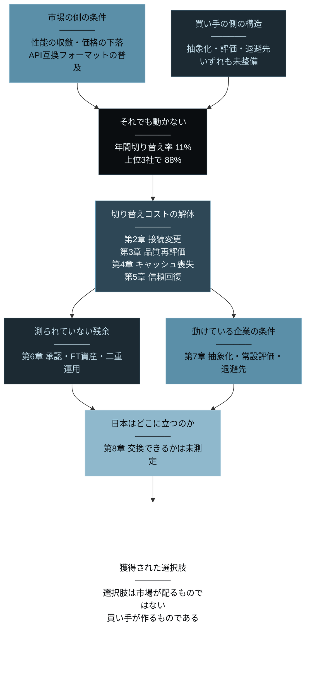
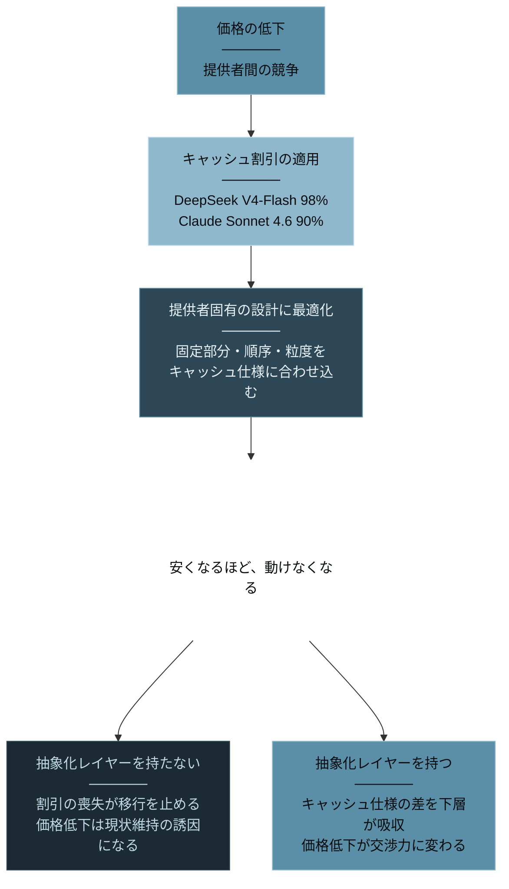
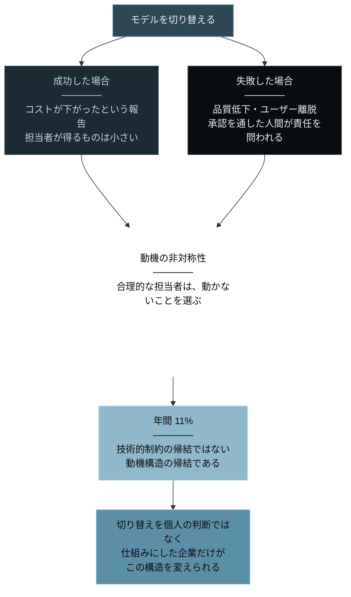
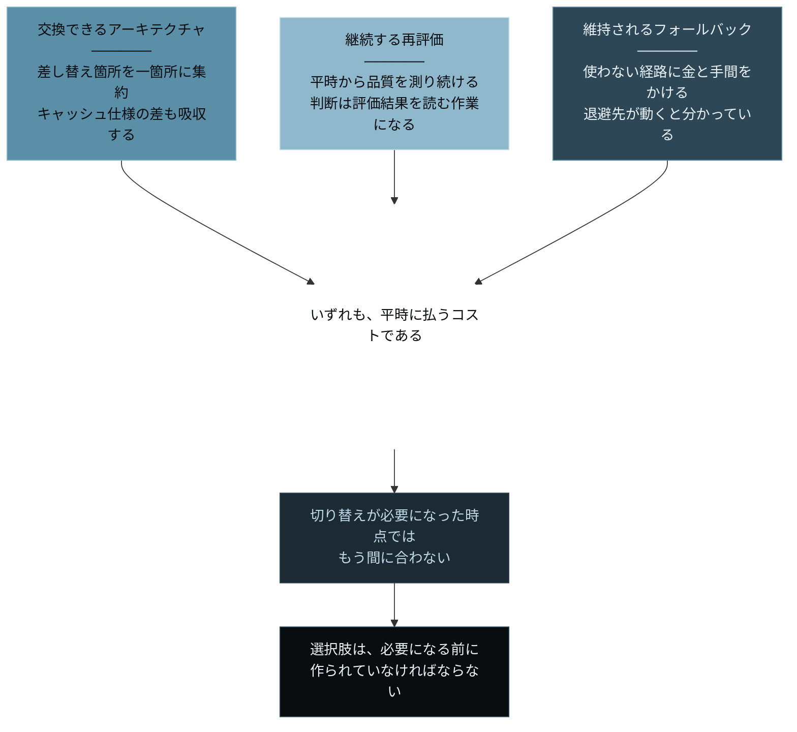
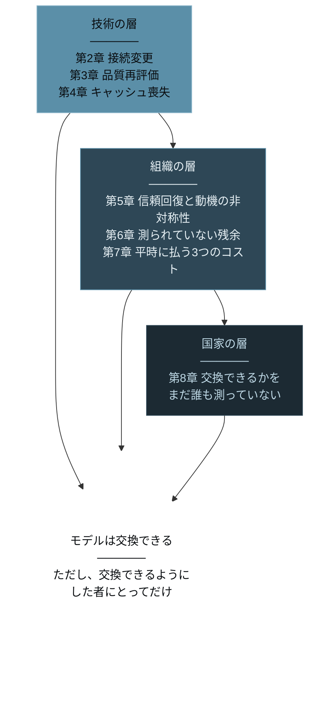

# Earned AI Model Optionality ── AIモデルは選べる。選べるのは、選べるようにした企業だけだ

> **"AI models are switchable. But only for companies that made them switchable."**
> （AIモデルは交換できる。ただし、交換できるようにした企業にとってだけ）

[](https://creativecommons.org/licenses/by/4.0/)
[](https://github.com/Leading-AI-IO/earned-ai-model-optionality)


<br/>

---

# 序章: 交換できるはずだった

Airbnbは、カスタマーサービスにAlibabaのQwenを使っている。<br/>
CEOのBrian Cheskyは、その理由を「fast and cheap（速くて安い）」と説明した。<br/>
Cursorを開発するAnysphereは、Composer系モデルの基盤にMoonshot AIのKimi系を採用したと報じられた。<br/>
Claudeから他社モデルへ切り替え、数百万ドル規模の節約を見込む企業も現れている。

**モデルは、交換された。**

米国議会はこれを見逃さなかった。<br/>
下院委員会はAirbnbとCursorの親会社に対し、中国由来モデルの利用について調査を開始している。<br/>
交換が起きたからこそ、規制側が動いた。

ここまでは、よく知られた話だ。<br/>
「AIモデルはコモディティ化した」「買い手の時代が来た」という結論も、あちこちで語られている。

だが、同じ2026年、Menlo Venturesはまったく別のことを報告している。

**ベンダー間の切り替えは比較的容易だが、ますます稀になっている。**

年間の切り替え率は、**11%**。<br/>
そしてエンタープライズのLLM API利用の**88%**は、OpenAI・Anthropic・Googleの3社に集中している。

交換できるはずのものが、交換されていない。<br/>
本書は、この矛盾から始まる。

## 「容易だが、稀」は矛盾ではない

一見すると、Menloの記述は矛盾している。<br/>
容易なら、なぜ稀なのか。

だが矛盾ではない。**「容易」が何を指しているかが、限定されているだけだ。**

APIのエンドポイントを書き換えることは、確かに容易である。<br/>
OpenAI互換フォーマットを採用しているモデル提供者は多く、SDKの初期化パラメータを数行変えれば、別のモデルへリクエストが飛ぶ。<br/>
そこだけを見れば、切り替えは1日で終わる作業だ。

しかし、AIエージェント基盤を開発するLindyの実測は、まったく別の風景を示している。<br/>
モデル移行の評価だけで**6〜9か月**。<br/>
実際の移行に要した労力は、**当初の想定の100倍**だった。

同社のエンジニアは、こう述べている。

> **モデル名を変えるのは簡単だった。ユーザーが引き続き信頼するかを証明する部分が仕事だった。**

この一文が、本書の全体を要約している。<br/>
交換されるのはモデル名ではない。**モデルの上に積み上げられた信頼のすべてである。**

## 本書が論じる「獲得された選択肢」とは何か

「AIモデルはコモディティ化した」という命題は、半分だけ正しい。

性能は収斂した。価格は下がり続けている。API互換フォーマットは広く採用された。<br/>
**市場の側の条件は、確かに整った。**

だが、その条件を交渉力に変換できているのは、ごく一部の企業だけである。<br/>
年間11%という数字が、それを示している。

本書は、この状態を一語で捉える。「**獲得された選択肢（Earned Optionality）**」だ。

獲得された選択肢とは、**モデルを交換できるという可能性が市場に存在していても、それを実際に行使できるのは、交換可能な構造を自ら構築した企業に限られるという状態**を指す。<br/>
選択肢は、市場が配るものではない。買い手が作るものである。

なぜ「マルチモデル運用」や「ベンダーロックイン回避」という既存の語ではなく、あえてこう呼ぶのか。<br/>
それは、この議論が「ロックインされているか、いないか」の二項で語られる限り、**責任の所在を永久に見誤る**からだ。

ロックインは、ベンダーが仕掛けるものだと考えられている。<br/>
だが本書が示すのは、その逆である。<br/>
**動けない企業の大半は、動けるようにしてこなかった企業だ。**

| | 通説としての「コモディティ化」 | 獲得された選択肢（本書の観測） |
|---|---|---|
| 切り替えの難易度 | API互換だから容易 | 接続は容易。評価・信頼・承認は容易ではない |
| 切り替えの頻度 | 価格差があれば動く | 年間11%。動く理由は価格でなく性能 |
| 市場の集中度 | 分散が進む | 上位3社で88% |
| 価格低下の恩恵 | 全買い手が享受する | 交換能力を持つ買い手だけが交渉力に変える |
| ロックインの原因 | ベンダーの囲い込み | 買い手が交換可能性を設計していないこと |

## 本書の読者と地図

本書は、次の3者のために書かれている。

* 第一に、**「AIコストが上がり続けている。もっと安いモデルに移せないか」と問われている情報システム部門・AI戦略責任者**。
移せるかどうかは、モデルの側ではなく自社の側で決まっている。本書はその構造を示す。

* 第二に、**AIを組み込んだプロダクトを持つ事業責任者・エンジニア**。
モデル移行のコストは、接続の書き換えではない。信頼の再証明である。その総額を分解する。

* 第三に、**AI産業の力学を、価格表ではなく構造として理解したい人**。
価格が下がっているのに買い手が動かない市場で、何が起きているのか。

本書の地図はこうだ。<br/>
まず、市場が動いていないという事実を確定させる（第1章）。<br/>
次に、切り替えコストを一つずつ解体する。<br/>
接続の互換性はどこで破れるのか（第2章）、品質の再評価に何が必要か（第3章）、<br/>
価格の低下がなぜロックインを生むのか（第4章）、そして最も重いコストである信頼の再証明とは何か（第5章）。<br/>
残るコストは誰にも測られていないことを示し（第6章）、<br/>
それでも動けている企業が何を作ったのかを見る（第7章）。<br/>
最後に、日本企業がこの問いのどこに立っているのかを問う（第8章）。

コストは、技術から組織へ、組織から国家へと層を移していく。<br/>
だが、どの層でも同じ命題が反復される。<br/>
**モデルは交換できる。ただし、交換できるようにした者にとってだけ。**

本書がたどる道筋を、一枚に整理する。



条件が整っている側は明るく、整っていない側は暗いまま残る。<br/>
そして、すべての経路が一点に収束する。

### 参考文献

1. Menlo Ventures「2025 Mid-Year LLM Market Update」（2025年7月31日）— 年間切り替え率11%／「切り替えは比較的容易だが、ますます稀になっている」<br/>https://menlovc.com/perspective/2025-mid-year-llm-market-update/
2. Menlo Ventures「2025: The State of Generative AI in the Enterprise」（2025年12月）— エンタープライズLLM API利用シェア Anthropic 40%／OpenAI 27%／Google 21%／上位3社合計88%<br/>https://menlovc.com/perspective/2025-the-state-of-generative-ai-in-the-enterprise/
3. Lindy「Migrating from Claude to DeepSeek」（2026年6月24日）— モデル移行の評価期間6〜9か月／移行労力は想定の100倍／エンジニア証言<br/>https://www.lindy.ai/blog/migrating-from-claude-to-deepseek
4. Semafor「Exclusive: House committees probe Cursor parent, Airbnb over Chinese AI」（2026年4月29日）<br/>https://www.semafor.com/article/04/29/2026/house-committee-probes-cursor-parent-airbnb-over-chinese-ai
5. CNBC「Chinese AI models costs US OpenAI Anthropic」（2026年7月7日）<br/>https://www.cnbc.com/2026/07/07/chinese-ai-models-costs-us-openai-anthropic.html

<br/>

---

# 第1章: 88%は、動いていない

「AIモデルはコモディティ化した」<br/>
2026年、この一文はほとんど前提として扱われている。

コモディティとは、供給者が入れ替わっても買い手が困らない財のことだ。<br/>
石油も、小麦も、メモリも、供給者は入れ替わる。だから価格が競争で決まる。

では、AIモデルは本当にそうなったのか。<br/>
確かめる方法は一つしかない。**買い手が実際に入れ替えているかを見ることである。**

## 市場は、価格では動かなかった

Menlo Venturesの調査によれば、企業がLLMベンダーを切り替える割合は**年間11%**である。<br/>
9割の企業は、1年間同じベンダーを使い続けている。

そしてエンタープライズのLLM API利用の**88%**は、OpenAI・Anthropic・Googleの3社が占める。<br/>
選択肢は増え続けているのに、実際の利用は3社に集中したままだ。

さらに重要なのは、切り替えが起きるときの理由である。<br/>
Menloは、切り替えを駆動するのは**価格ではなく性能**だと明記している。

これは、コモディティ市場の定義と正面から衝突する。<br/>
コモディティなら、価格が決定要因になるはずだ。<br/>
**性能で選ばれている限り、それはまだコモディティではない。**

## 価格は、確かに下がっている

一方で、価格が下がっていないわけではない。

主要モデルのAPI価格は継続的に下がり、キャッシュ機構を使えば劇的な割引が適用される。<br/>
DeepSeek V4-Flashはキャッシュヒット時に**98%割引**、Claude Sonnet 4.6は**90%割引**を提供している。<br/>
中国系モデルと米国系モデルの間には、報道ベースで60〜90%の価格差があるとされる。

**価格の条件は整っている。それでも市場は動いていない。**

ここに、本書が扱う問いの全体がある。<br/>
価格差が存在し、互換APIが存在し、切り替えは「比較的容易」と評価されている。<br/>
それでも年間11%しか動かない。

**動かない理由は、市場の側にはない。**

## 供給は、集中しなかった

価格だけではない。**供給の条件も、整い続けている。**

2026年に入るまで、有力な予測は逆だった。<br/>
訓練コストが毎年桁違いに増大する以上、モデルを訓練できる組織は淘汰され、少数へ統合されていく——これは不可避とすら言われていた。

だが、そうはならなかった。<br/>
AI研究の分析者Nathan Lambertらは、2026年8月時点でこう総括している。<br/>
統合が起きるどころか、**強力なモデルを訓練する企業はむしろ増え、それを公開する組織も増えている**。<br/>
数億から数十億ドル規模の投資が依然として必要でありながら、である。

彼らはその理由をこう説明する。<br/>
統合が必要になるはずだった研究所群が、**トークンを生成する機械を作ること自体が価値への経路になる**と気づきつつある、と。

具体例が、この構図を裏づけている。

中国のMeituanが公開したLongCat-2.0は、総パラメータ1.6兆・トークンあたり活性約48億のMoEであり、**MITライセンス**で提供されている。<br/>
同社は、訓練から推論までの全工程を国産のAI ASICスーパーポッド上で完了したと発表しており、兆パラメータ級モデルとしては業界初だと主張している。

ただし、ここには注意が要る。<br/>
**Meituanはチップのベンダー名も型番も公表していない。** <br/>
公式の表現は「国産AIコンピュートチップ」に留まる。<br/>
約5万枚のAscend 910Cという数字は報道とコミュニティの推論であり、MeituanもHuaweiも確認していない。<br/>
35兆トークン超という訓練規模も自己申告であり、第三者検証は存在しない。

**それでも構造上の含意は変わらない。** <br/>
特定のベンダーに依存しない訓練環境が、兆パラメータ級で成立しうると主張される段階に入った。<br/>
訓練能力は、地理的にも供給元的にも分散している。

ライセンスの側では、さらに複雑な動きが同時に起きている。<br/>
Tencentは、Hy3の公開にあたって従来の制限的な独自ライセンスからApache 2.0へ切り替えた。<br/>
poolsideはLaguna-S-2.1で、Apache 2.0に近い自由度を持ちながらAIモデルに特化した法的裏づけを備えるOpenMDWを採用している。<br/>
一方でMoonshot AIのKimi K3は非商用ライセンスで公開され、推論やファインチューニングを提供する事業者に商用契約の締結を求めている。

**自由化と厳格化が、同じ市場で同時に進行している。** <br/>
「オープン」はもはや単一の状態ではなく、ライセンス設計そのものが競争変数になった。

ここで、数字を並べ直す。

供給者の数は増えた。訓練環境の選択肢も増えた。ライセンスの自由度も、少なくとも一部では上がった。<br/>
そして需要側では、年間の切り替えが11%。上位3社が88%を占めたままだ。

**供給の分散は、需要の分散をもたらさなかった。**

では、その11%は誰だったのか。

## 「動ける企業」と「動けない企業」は、別の市場にいる

11%という数字は、平均である。<br/>
平均は、しばしば構造を隠す。

Airbnbは動いた。Cursorは動いた。Claudeから他社へ移して数百万ドルを節約した企業も動いた。<br/>
一方で、89%は動いていない。

同じ市場に、同じ価格表があり、同じ互換APIがある。<br/>
それでも一方は動き、他方は動かない。<br/>
**差は、モデル側ではなく買い手側にある。**

本書の残りの章は、この差が何でできているかを一つずつ解体していく。<br/>
そして最後に、動ける企業が何を作っていたのかを示す。

### 参考文献

1. Menlo Ventures「2025 Mid-Year LLM Market Update」（2025年7月31日）— 年間切り替え率11%／切り替え要因は性能<br/>https://menlovc.com/perspective/2025-mid-year-llm-market-update/
2. Menlo Ventures「2025: The State of Generative AI in the Enterprise」（2025年12月）— エンタープライズLLM API利用シェア Anthropic 40%／OpenAI 27%／Google 21%／上位3社合計88%<br/>https://menlovc.com/perspective/2025-the-state-of-generative-ai-in-the-enterprise/
3. DeepSeek「Models & Pricing」— V4-Flash キャッシュヒット時98%割引<br/>https://api-docs.deepseek.com/quick_start/pricing/
4. Anthropic「Pricing」（Claude Platform Docs）— Claude Sonnet 4.6 プロンプトキャッシュ読み取りは基本入力単価の0.1倍（$3/MTok → $0.30/MTok）＝90%割引<br/>https://platform.claude.com/docs/en/about-claude/pricing
5. CNBC「Chinese AI models costs US OpenAI Anthropic」（2026年7月7日）— 中国系モデルの価格優位<br/>https://www.cnbc.com/2026/07/07/chinese-ai-models-costs-us-openai-anthropic.html

<br/>

---

# 第2章: 互換と書いてある。互換ではない

切り替えコストの分解は、最も表層から始めるのが正しい。<br/>
接続の変更である。

ここは、誰もが「容易だ」と考えている領域だ。<br/>
そして実際、**大部分は容易である。** 問題は、容易でない部分が事前に見えないことにある。

## OpenAI互換は、契約ではない

多くのモデル提供者が「OpenAI互換API」を掲げている。<br/>
リクエストとレスポンスのスキーマをOpenAIに合わせることで、既存のSDKやツールチェーンをそのまま使えるようにする、という約束だ。

だがこの「互換」は、標準化団体が定義した仕様ではない。<br/>
**各社が自主的に「合わせている」と宣言しているだけである。**

したがって、合っている範囲も、ずれている箇所も、提供者ごとに異なる。<br/>
そしてずれは、動かないという形では現れない。<br/>
**動くが、違う結果を返すという形で現れる。**

## ずれは、具体的に記録されている

抽象論ではない。<br/>
複数のモデル提供者を統一インターフェースで束ねるライブラリLiteLLMの公開issueには、互換性の破れが具体的に記録されている。

* **ツール呼び出しが静かに落ちる**（issue #17246）<br/>
モデルにツールを渡しているのに、呼び出しが実行されないまま応答が返る。エラーは出ない。

* **`thinking_blocks` の欠落による400エラー**（issue #7292）<br/>
推論過程を保持するフィールドが、プロバイダ間の変換で失われ、リクエストが拒否される。

* **構造化画像コンテンツの破損**（issue #17762）<br/>
マルチモーダル入力の構造が変換の過程で崩れる。

いずれも、モデルを差し替えた瞬間には気づけない種類の障害である。<br/>
**テストが通り、デプロイが成功し、そのあとで挙動が変わっていることに気づく。**

## 「動く」と「同じように動く」は違う

接続変更のコストが軽く見積もられるのは、**「動くかどうか」で検証してしまうから**だ。

エンドポイントを変えて、リクエストが200を返せば、移行は完了したように見える。<br/>
だが本当に確かめなければならないのは、**同じ入力に対して、実務上同じ品質の出力が返るか**である。

そしてそれは、接続の問題ではない。品質の問題だ。<br/>
本書は次章で、そのコストを見る。

ここで確定させておくべきことは一つである。<br/>
**接続変更は容易だが、容易さの範囲は「つながること」までであり、「同じであること」までではない。**

### 参考文献

1. LiteLLM 公式ドキュメント「Reasoning Content」— プロバイダ間の互換性に関する既知の制約（`thinking_blocks` 欠落による400エラーを含む）<br/>https://docs.litellm.ai/docs/reasoning_content
2. LiteLLM GitHub issue #17246 — ツール呼び出しの静かなドロップ<br/>https://github.com/BerriAI/litellm/issues/17246
3. LiteLLM GitHub issue #7292 — o1モデルへの関数呼び出しが `UnsupportedParamsError` で失敗<br/>https://github.com/BerriAI/litellm/issues/7292
4. LiteLLM GitHub issue #17762 — 構造化画像コンテンツの破損<br/>https://github.com/BerriAI/litellm/issues/17762

<br/>

---

# 第3章: 6ヶ月と、100倍の労力

接続が済んだあと、本当の作業が始まる。<br/>
**品質の再評価である。**

## Lindyが測った、実際の期間

AIエージェント基盤を開発するLindyは、モデル移行の実測値を公開している。

**評価だけで6〜9か月。**<br/>
**実際の移行に要した労力は、当初の想定の100倍。**

この数字は、単一企業の一事例である。<br/>
統計的な代表性はない。だが、**モデル移行のコストを期間と労力の両面で公開した事例そのものが稀**であり、その意味で貴重な一次情報だ。

なぜ、そこまでかかるのか。

## 再評価は、ベンチマークではない

「モデルを評価する」と聞いて、多くの人は公開ベンチマークのスコア比較を思い浮かべる。<br/>
だが、実務における再評価はそれとはまったく別の作業だ。

公開ベンチマークが答えるのは「このモデルは一般的に賢いか」である。<br/>
実務が答えなければならないのは「**このモデルは、うちの業務で、うちの基準を満たすか**」である。

後者に答えるには、まず自社の基準が必要になる。<br/>
何をもって正解とするのか。どの誤りが許容範囲で、どの誤りが致命的なのか。<br/>
その基準が明文化されていなければ、比較そのものが成立しない。

**多くの企業がモデルを切り替えられない最初の理由は、ここにある。**<br/>
比較する物差しを持っていないから、比較ができない。<br/>
物差しがなければ、現行モデルを使い続けることが、唯一の安全な選択になる。

## プロンプトは、モデルに最適化されている

もう一つの負荷は、プロンプト資産である。

運用中のプロンプトは、特定のモデルの癖に合わせて調整されている。<br/>
指示の順序、例示の数、出力形式の指定方法。<br/>
これらは試行錯誤の結果として現在の形になっており、**その調整はモデル固有である。**

別のモデルに同じプロンプトを渡すと、多くの場合、品質は落ちる。<br/>
落ちた品質を回復させるには、再び調整が必要になる。<br/>
そして調整の結果を評価するには、また基準が要る。

**プロンプト再設計と品質再評価は、切り離せない。**<br/>
片方だけを終わらせることができない構造になっている。

## 「性能で切り替える」の意味

第1章で確認した通り、Menloは切り替えを駆動するのは価格ではなく性能だと報告している。

この事実は、本章の内容と整合する。<br/>
**再評価に6〜9か月かかるなら、価格差だけでは元が取れない。**

年間のAPI費用が数百万円規模の企業にとって、6か月の評価工数は価格差を上回る。<br/>
価格が動機になるのは、支出が十分に大きく、かつ評価の仕組みが既にある企業だけだ。

だから市場は、性能が明確に上がったときにしか動かない。<br/>
**価格弾力性が低いのではない。価格弾力性を持つための固定費が高いのである。**

### 参考文献

1. Lindy「Migrating from Claude to DeepSeek」（2026年6月24日）— モデル移行の評価期間6〜9か月／移行労力は想定の100倍<br/>https://www.lindy.ai/blog/migrating-from-claude-to-deepseek
2. Menlo Ventures「2025 Mid-Year LLM Market Update」（2025年7月31日）— 切り替え要因は価格ではなく性能<br/>https://menlovc.com/perspective/2025-mid-year-llm-market-update/

<br/>

---

# 第4章: 安くなるほど、動けなくなる

価格の低下は、買い手にとって有利に働く。<br/>
これは経済学の常識であり、本書の中核命題も当初はその前提に立っていた。

だが、AIモデル市場では、そうならない経路が存在する。

## キャッシュという割引の正体

主要なモデル提供者は、プロンプトキャッシュ機構を提供している。<br/>
同じ内容の入力が繰り返し送られる場合、その部分の処理結果を再利用し、大幅に安い単価を適用する仕組みだ。

割引率は劇的である。<br/>
DeepSeek V4-Flashはキャッシュヒット時に**98%割引**。<br/>
Claude Sonnet 4.6は**90%割引**。

エージェント型の用途では、システムプロンプトや参照文書が毎回同じであることが多い。<br/>
したがってキャッシュヒット率は高くなり、実効単価は表示価格を大きく下回る。

**買い手にとって、これは純然たる利益である。** 少なくとも短期的には。

## 温めたキャッシュは、持ち出せない

問題は、キャッシュが**提供者ごとに固有**であることだ。

あるモデルでキャッシュを効かせている構成は、別のモデルへ移した瞬間にゼロから始まる。<br/>
移行直後は、キャッシュのない状態の単価が適用される。<br/>
つまり**移行の初期には、コストが上がる。**

しかもキャッシュ最適化は、単に機構を有効にすれば済むものではない。<br/>
どこまでを固定部分として設計するか、どの順序で組み立てるか、どの粒度で分割するか。<br/>
**これらの設計は、提供者ごとのキャッシュ仕様に依存する。**

98%の割引を享受している企業ほど、その割引を失う移行のハードルは高くなる。

## 価格低下が、ロックインの原資になる

ここに反転がある。

価格の低下は、買い手の交渉力を上げるはずだった。<br/>
だが割引の大部分がキャッシュ由来である場合、**その割引は特定の提供者に紐づいている。**

一般的な値下げなら、買い手はどこへでも持っていける。<br/>
キャッシュ割引は、持っていけない。

**安くなるほど、動けなくなる。**

これは提供者側の陰謀ではない。<br/>
キャッシュは計算資源の合理的な節約であり、その恩恵を価格に反映するのは自然な設計だ。<br/>
だが結果として、**価格競争が進むほどロックインが強まるという構造が成立している。**

この反転を、一枚に整理する。



同じ割引が、抽象化の有無によって正反対の作用をする。

## 交渉力の条件が、ここで一つ確定する

本章から導かれる帰結は明確である。

価格の低下を交渉力に変換できるのは、**キャッシュ設計を提供者に依存しない形で抽象化している企業だけ**だ。<br/>
そうでない企業にとって、価格の低下は交渉材料ではなく、**現状維持のインセンティブ**として作用する。

第7章で見る「選べる企業」は、例外なくこの層を自前で持っている。

### 参考文献

1. DeepSeek「Models & Pricing」— V4-Flash キャッシュヒット時98%割引<br/>https://api-docs.deepseek.com/quick_start/pricing/
2. Anthropic「Pricing」（Claude Platform Docs）— Claude Sonnet 4.6 プロンプトキャッシュ読み取りは基本入力単価の0.1倍（$3/MTok → $0.30/MTok）＝90%割引<br/>https://platform.claude.com/docs/en/about-claude/pricing

<br/>

---

# 第5章: ユーザーが信頼するかを、証明する仕事

ここまでの4章で見てきたのは、技術と価格のコストである。<br/>
だが、実測が示す最大のコストはそこにない。

Lindyのエンジニアの言葉を、もう一度置く。

> **モデル名を変えるのは簡単だった。ユーザーが引き続き信頼するかを証明する部分が仕事だった。**

## 信頼は、モデルではなくプロダクトに宿る

ユーザーは、企業がどのモデルを使っているかを知らない。<br/>
知る必要もない。ユーザーが評価しているのは、目の前のプロダクトの挙動だけである。

そのプロダクトは、特定のモデルの上で、時間をかけて調整されてきた。<br/>
どんな質問にどう答えるか。どこで断るか。どんな口調で話すか。<br/>
これらはすべて、**現行モデルの振る舞いを前提に設計された結果**だ。

モデルを差し替えると、この全体が揺らぐ。<br/>
ベンチマークのスコアが同等でも、**同等であることとユーザーが同じだと感じることは別である。**

## 証明する相手は、社内にもいる

信頼の再証明は、対ユーザーだけの作業ではない。

多くの企業で、AIプロダクトの品質は複数の部門が承認している。<br/>
法務、セキュリティ、コンプライアンス、カスタマーサポート。<br/>
現行モデルは、その承認をすでに通過している。

モデルを変えるということは、**その承認をもう一度取り直すということだ。**

そしてこの承認は、技術的な同等性だけでは通らない。<br/>
「なぜ変えるのか」「変えて何が良くなるのか」「悪化したときどう戻すのか」<br/>
これらに答える責任は、切り替えを提案した側が負う。

**切り替えのコストには、説明責任のコストが含まれている。**

## 動機の非対称性

ここから、市場が動かない理由の中核が見えてくる。

**モデルを切り替えて成功しても、担当者に得るものは少ない。**<br/>
コストが下がった、という報告が上がるだけだ。

**失敗すれば、失うものは大きい。**<br/>
品質が落ち、ユーザーが離れ、社内の承認を通した人間が責任を問われる。

この非対称性の下では、合理的な担当者は動かないことを選ぶ。<br/>
価格差が数十%あっても、動かない。

**年間11%という数字は、技術的制約の帰結ではない。動機構造の帰結である。**

そしてこの構造を変えられるのは、**切り替えを個人の判断ではなく仕組みにした企業だけ**だ。

この構造を、一枚に整理する。



報酬の小ささと責任の重さは、同じ一つの決定にぶら下がっている。

### 参考文献

1. Lindy「Migrating from Claude to DeepSeek」（2026年6月24日）— エンジニア証言「モデル名を変えるのは簡単だった。ユーザーが引き続き信頼するかを証明する部分が仕事だった」<br/>https://www.lindy.ai/blog/migrating-from-claude-to-deepseek
2. Menlo Ventures「2025 Mid-Year LLM Market Update」（2025年7月31日）— 年間切り替え率11%<br/>https://menlovc.com/perspective/2025-mid-year-llm-market-update/

<br/>

---

# 第6章: 残りのコストは、誰も測っていない

本書は、切り替えの総コストを次のように分解している。

```
総切り替えコスト ＝ 接続変更 ＋ プロンプト再設計 ＋ ツール・構造化出力修正
                ＋ 品質再評価 ＋ 安全性・法務承認
                ＋ キャッシュ／ファインチューニングの喪失
                ＋ ユーザー信頼回復 ＋ 移行期間中の二重運用
```

第2章から第5章までで、このうち5項目を実測または一次資料で扱った。<br/>
残る3項目——**安全性・法務承認、ファインチューニング資産の喪失、移行期間中の二重運用**——について、本章は正直に書かなければならない。

**これらを定量化した資料は、発見できなかった。**

測れた側と、測れなかった側を分けて示す。

```mermaid
graph TD
    A["総切り替えコスト<br/>──────<br/>8項目に分解"] --> B["実測または一次資料で扱えた<br/>──────<br/>接続変更・プロンプト再設計<br/>ツール／構造化出力修正<br/>品質再評価・ユーザー信頼回復"]
    A --> C["定量化した資料が存在しない<br/>──────<br/>安全性・法務承認<br/>ファインチューニング資産の喪失<br/>移行期間中の二重運用"]
    B --> D["議題になる<br/>──────<br/>数字があるから比較できる"]
    C --> E["議題にならない<br/>──────<br/>数字がないから見積もれない"]
    D --> F{"測られていないものは、改善されない"}
    E --> F

    style A fill:#2E4756,stroke:#5B8FA8,color:#E8F1F5
    style B fill:#5B8FA8,stroke:#8FB8CC,color:#0A0D10
    style C fill:#0A0D10,stroke:#2E4756,color:#E8F1F5
    style D fill:#8FB8CC,stroke:#BFD9E6,color:#0A0D10
    style E fill:#1C2A33,stroke:#2E4756,color:#BFD9E6
    style F fill:#FFFFFF,stroke:#FFFFFF,color:#0A0D10
```



空白は、コストが小さいことを意味しない。見積もられていないことを意味する。

## 3つのエンジンが、同じ空白を報告した

本書の調査は、Claude・ChatGPT・Geminiの3つの調査エンジンに同一の指示を与え、独立に実行させた。<br/>
そのうえで、回答を突合している。

3つは、独立に、ほぼ同じ空白を報告した。

* **Claude**：「モデル選定」を独立した組織能力として体系的に論じた資料は乏しい
* **ChatGPT**：「候補発見→試験→安全承認→価格交渉→ルーティング→再評価→撤退」を一つの組織能力として測定した代表的資料は確認できなかった
* **Gemini**：情報システム部門や調達部門がAIモデルをどうRFPに落とし込むかの標準化ドキュメントは存在しなかった

これは「探し方が悪かった」で片づけられる種類の不在ではない。<br/>
**3つが別々の経路で探し、同じ場所に何もなかったと報告している。**

## 不在は、何を意味するのか

AIモデルの調達は、すでに多くの企業で年間数千万円から数億円規模の支出になっている。<br/>
それだけの支出に対して、**選定・評価・撤退の標準的な手順が存在しない。**

比較のために考えてほしい。<br/>
クラウドインフラの調達には、標準的な評価軸がある。<br/>
SaaSの選定にも、比較表とRFPのテンプレートがある。<br/>
人材の採用にも、評価基準と面接プロセスがある。

**AIモデルにだけ、それがない。**

ないから、各社が個別に判断している。<br/>
個別に判断しているから、判断の質が組織能力として蓄積されない。<br/>
蓄積されないから、次の切り替えでも同じコストがかかる。

## 測られていないものは、改善されない

本章の結論は、控えめだが重要である。

**残る3項目のコストが小さいという証拠はない。むしろ、測られていないだけである可能性が高い。**

安全性・法務承認は、第5章で見た通り、実務上は最も硬い関門になり得る。<br/>
ファインチューニング済みモデルを運用している企業にとって、その資産の喪失は移行の中止理由になり得る。<br/>
二重運用の期間は、そのままコストの二重計上になる。

いずれも、実務者は経験的に知っている。<br/>
だが、**知っていることと、測られていることは違う。**

測られていないものは、経営会議の議題にならない。<br/>
議題にならないものは、投資判断の対象にならない。<br/>
**この空白そのものが、多くの企業が動けない理由の一部を構成している。**

### 参考文献

1. 本書調査（2026年7月・Claude / ChatGPT / Gemini による独立調査の突合）— 3エンジンが独立に報告した空白<br/>（本書独自調査のため公開URLなし）
2. 本書調査（2026年7月・ChatGPT 調査回答）— 総切り替えコストの分解式<br/>（本書独自調査のため公開URLなし）

<br/>

---

# 第7章: 選べる企業は、何を作ったのか

11%は動いた。<br/>
本章は、その11%が何を持っていたのかを見る。

調査の結論部は、こう述べている。

> **モデルを交換できるアーキテクチャを持ち、再評価を継続し、複数のフォールバックを維持できる企業だけが、モデル価格の低下を交渉力へ変換できる。切り替えの容易さは市場全体の属性ではなく、買い手が構築する組織的・技術的能力である。**

この一文を、3つの構成要素に分解する。

## 第一に、交換できるアーキテクチャ

モデルを直接呼び出しているアプリケーションは、切り替えられない。<br/>
呼び出し箇所がコードベース全体に散らばっていれば、変更対象が特定できないからだ。

動ける企業は、モデル呼び出しを**抽象化レイヤーの背後に隔離している。**<br/>
ゲートウェイ、ルーター、あるいは自前の薄いラッパー。形式は問わない。<br/>
重要なのは、**モデルを差し替える箇所が一箇所に集約されていること**である。

そしてこの層は、第4章で見たキャッシュ設計も吸収する。<br/>
提供者ごとのキャッシュ仕様の差を、この層が引き受けることで、上位のアプリケーションは影響を受けない。

**この層を持たない企業にとって、切り替えは全面改修になる。持つ企業にとっては、設定変更になる。**

## 第二に、継続する再評価

第3章で見た通り、再評価には自社の基準が要る。<br/>
そして基準は、必要になってから作れるものではない。

動ける企業は、**現行モデルの品質を平時から測り続けている。**<br/>
評価用のデータセットがあり、合否の基準があり、定期的に走らせる仕組みがある。

平時に測っているから、新しいモデルが出たときに比較ができる。<br/>
比較ができるから、意思決定が数週間で済む。

**6〜9か月かかるのは、評価を切り替えの直前に始めるからである。**<br/>
評価が常設されていれば、切り替えの判断は評価結果を読むだけの作業になる。

## 第三に、維持されるフォールバック

3つ目が、最も見落とされやすい。

動ける企業は、**使っていないモデルへの経路を維持している。**<br/>
本番トラフィックの一部を流す、あるいは定期的に疎通を確認する。

この維持にはコストがかかる。<br/>
使わないものに金と手間をかけるのだから、短期的には無駄である。

だが、この無駄が交渉力の実体だ。<br/>
**退避先が実際に動くと分かっている企業だけが、現行ベンダーとの交渉で本気の代替案を持てる。**

退避先が「理論上は移行可能」でしかない企業は、交渉の席で何も持っていない。<br/>
相手もそれを知っている。

## 3つは、一つのことを言っている

抽象化レイヤー、常設の評価、維持されたフォールバック。<br/>
この3つは、いずれも**平時のコスト**である。

切り替えが必要になったときには、もう間に合わない。<br/>
**選択肢は、必要になる前に作られていなければならない。**

3つの関係を、一枚に整理する。



3つはいずれも、切り替えないあいだは無駄に見える支出である。

これが「獲得された選択肢」の意味である。<br/>
選択肢は市場に存在する。だが、それを行使できる状態は、買い手が自分で作る。

### 参考文献

1. 本書調査（2026年7月・ChatGPT 調査回答）— 交換可能なアーキテクチャ・再評価の継続・フォールバックの維持<br/>（本書独自調査のため公開URLなし）
2. LiteLLM 公式ドキュメント — 統一インターフェースによるプロバイダ抽象化<br/>https://docs.litellm.ai/

<br/>

---

# 第8章: 日本企業は、選べる側にいるか

本書は、日本語で書かれている。<br/>
したがって、この問いを避けることはできない。

**日本企業は、モデルを交換できる側にいるのか。**

結論から書く。**分からない。測られていないからである。**

## 分かっていること

日本のAI導入について、いくつかの数字は存在する。

総務省『令和7年版 情報通信白書』によれば、何らかの業務で生成AIを利用している日本企業は**55.2%**。<br/>
中国95.8%、米国90.6%、ドイツ90.3%と、いずれも90%を超えている。

Dynatraceの調査では、社内と社外の両方でAIエージェントを利用している日本企業は**11%**。<br/>
世界平均は50%であり、5分の1にとどまる。

情報処理推進機構（IPA）の調査では、DX人材の不足を訴える企業が**85.1%**にのぼる。

これらはいずれも、日本のAI活用が国際的に遅れていることを示している。

## だが、本書が問うているのはそこではない

導入率も、エージェント利用率も、人材不足も、**AI活用一般の指標**である。<br/>
本書が問うているのは、それとは別のことだ。

**日本企業は、モデルを交換できる構造を持っているのか。**<br/>
抽象化レイヤーを持っているのか。評価を常設しているのか。退避先を維持しているのか。

この問いに答えるデータは、**一件も見つからなかった。**

* 日本企業のマルチモデル運用率 — **データなし**
* 日本企業がモデルを切り替えた個社事例 — **公表事例なし**
* 調達部門がAIモデルをRFPに落とす標準手順 — **存在しないことを確認**

## 測っていないことの意味

3つ目が、最も重い。

Geminiの調査は、日本の情報システム部門や調達部門がAIモデルをどう評価・選定するかの標準化ドキュメントを探し、**存在しなかった**と報告している。

これは、日本企業に能力がないという意味ではない。<br/>
**能力があるかどうかを、まだ誰も問うていないという意味である。**

導入率は測られている。人材不足は測られている。<br/>
だが、**入れたAIをいつでも入れ替えられるかは、測られていない。**

## 遅れているのか、まだ問われていないのか

日本の生成AI利用率55.2%という数字は、しばしば危機感を煽る文脈で引かれる。<br/>
だが本書の観点からは、別の読み方ができる。

導入が遅いということは、**まだ大規模なロックインが形成されていない**ということでもある。<br/>
第4章で見たキャッシュ最適化も、第5章で見た社内承認の蓄積も、導入の深さに比例して重くなる。

先に深く入った企業ほど、動きにくくなっている。<br/>
これは第1章で見た通り、世界共通の構造である。

**日本企業がいまから設計できるものがあるとすれば、それは導入の速さではなく、導入の形である。**

抽象化レイヤーを最初から挟むのか。評価を最初から常設するのか。<br/>
これらは、後から追加するより、最初から入れるほうが安い。

## それでも、測ることから始まる

本章は、他章より短い。<br/>
書けることが少ないからである。

だが、その少なさ自体が観測結果だ。<br/>
**日本企業がモデルを交換できるかどうかは、いま誰も測っていない。**

測られていないものは、改善されない。<br/>
第6章と同じ結論が、ここでも繰り返される。

### 参考文献

1. 野村総合研究所「ユーザー企業のIT活用実態調査（2025年）」（2025年11月25日）— 日本の生成AI導入率57.7%<br/>https://www.nri.com/jp/news/newsrelease/20251125_1.html
2. 総務省『令和7年版 情報通信白書』第1部第2節「企業におけるAI利用の現状」— 何らかの業務で生成AIを利用している企業の割合は日本55.2%（図表Ⅰ-1-2-14に米・中・独との国際比較）<br/>https://www.soumu.go.jp/johotsusintokei/whitepaper/ja/r07/html/nd112220.html
3. Dynatrace「2026年版エージェント型AIの動向（The Pulse of Agentic AI 2026）」（原文2026年1月22日発表）— 「社内および社外の両方」の用途でエージェント型AIを利用している日本企業11%／グローバル平均50%<br/>https://www.dynatrace.com/news/press-release/agentic-ai-report-2026-jp/
4. 情報処理推進機構（IPA）「AI時代のデジタル人材育成」（『DX動向2025』に基づく）— DXを推進する人材の「量」が不足していると回答した日本企業85.1%（米国23.8%／ドイツ44.6%）<br/>https://www.ipa.go.jp/digital/chousa/discussion-paper/dx2025_digital_talent_ai_era.html
5. 本書調査（2026年7月・Gemini 調査回答）— 日本の調達部門におけるAIモデル選定の標準化ドキュメントは存在しないことを確認<br/>（本書独自調査のため公開URLなし）

<br/>

---

# 終章: 選択肢は、獲得するものである

## 8つのコストが、一つのことを言っている

本書は、切り替えの総コストを8つに分解し、章として展開してきた。

| 章 | コスト | 何が動きを止めているのか |
|---|---|---|
| 第1章 | （前提） | 年間11%。上位3社で88%。価格では動かない |
| 第2章 | 接続変更 | 互換は契約ではない。ずれは静かに起きる |
| 第3章 | 品質再評価 | 6〜9か月。基準がなければ比較すらできない |
| 第4章 | キャッシュ喪失 | 98%割引は持ち出せない。安くなるほど動けない |
| 第5章 | 信頼回復 | 成功の報酬は小さく、失敗の責任は重い |
| 第6章 | 承認・二重運用・FT資産 | 測られていない。だから議題にならない |
| 第7章 | （能力） | 抽象化・常設評価・退避先。すべて平時のコスト |
| 第8章 | （日本） | 交換できるかどうかを、まだ誰も測っていない |

コストは技術から組織へ、組織から国家へと層を移す。<br/>
だが、どの層でも同じ命題が反復される。

**モデルは交換できる。ただし、交換できるようにした者にとってだけ。**

層の移動を、一枚に整理する。



層が変わっても、命題は同じ形で反復される。

## 想定される、3つの反論

### 反論1：「OpenAI互換APIがあるのだから、切り替えは容易だ」

容易なのは接続だけである。<br/>
LiteLLMの公開issueは、ツール呼び出しの静かなドロップ、`thinking_blocks` 欠落による400エラー、構造化画像コンテンツの破損を記録している。<br/>
そしてLindyの実測は、評価に6〜9か月、労力は想定の100倍だったと報告している。

**互換APIが保証しているのは「つながること」であって、「同じであること」ではない。**

### 反論2：「ルーターやゲートウェイを入れれば解決する」

半分正しい。第7章で見た通り、抽象化レイヤーは交換能力の第一条件である。<br/>
だが、それは3条件のうちの1つにすぎない。

ルーターを入れても、自社の評価基準がなければ比較ができない。<br/>
評価基準があっても、退避先を平時に維持していなければ、移行が動くかどうか分からない。

**ツールは能力の一部を代替するが、全部は代替しない。**<br/>
残りは組織側の設計である。

### 反論3：「結局は最高性能のモデルに戻るだけだ」

データはその可能性を否定していない。<br/>
Menloは、切り替えを駆動するのは価格ではなく性能だと明記している。<br/>
エンタープライズ利用の88%は上位3社に集中したままだ。

だが、それは本書の命題と矛盾しない。<br/>
**性能で選び直せること自体が、交換能力を必要とする。**

最高性能のモデルは入れ替わる。<br/>
入れ替わるたびに移れる企業と、移れない企業がいる。<br/>
**「最高性能に張り続ける」戦略こそ、最も高い交換能力を要求する。**

## 移動したのは、選択肢の所在ではない

本書の中核命題を、最後にもう一度置く。

**選択肢は、市場が与えるものではない。買い手が自分で獲得するものである。**

価格は下がった。互換APIは広まった。モデルの数は増え続けている。<br/>
**市場の側の条件は、すべて整っている。**

それでも年間11%しか動かない。<br/>
足りないのは市場ではない。買い手側の構造である。

## 「測れるようにした」ことと、「選べるようにした」こと

本書には、対になる論考がある。

私は別稿で、AIエージェント市場において選ばれている領域は「測れる業務」ではなく「**測れるようにした業務**」であると書いた。<br/>
測定可能性は、業務に最初から備わっているのではない。誰かがルール化した結果として生まれる。

本書の命題は、その双子である。<br/>
**交換可能性も、市場に最初から備わっているのではない。買い手が構造として作った結果として生まれる。**

売り手の側では、測れるようにした者が選ばれる。<br/>
買い手の側では、選べるようにした者が交渉力を持つ。<br/>
**同じ構造が、市場の両側で作動している。**

## 動けない9割へ

本書は、動けていない89%を責めるために書かれてはいない。

動かないことは、多くの場合、合理的だった。<br/>
第5章で見た動機の非対称性の下では、動かないほうが個人にとって安全である。<br/>
その構造を作ったのは担当者ではなく、組織の設計だ。

だが、その合理性には期限がある。

モデルの性能は上がり続け、価格は下がり続ける。<br/>
そのたびに、動ける企業と動けない企業の差は開く。<br/>
**差を生んでいるのは技術力ではない。平時にコストを払う判断である。**

抽象化レイヤーを挟むこと。評価を常設すること。使わない経路を維持すること。<br/>
いずれも、今日は無駄に見える。<br/>
**その無駄が、交渉力の正体である。**

私は、この結論に利害を持たない。<br/>
特定のモデル提供者を売る立場にない。ゲートウェイ製品を売る立場にもない。<br/>
**だから、こう書ける。**

**AIモデルは選べる。選べるのは、選べるようにした企業だけだ。**

<br/>

---

## Related Projects

本書は、著者のオープンソース知識リポジトリエコシステムの一作として位置づけられる。

| プロジェクト | 概要 | リンク |
|---|---|---|
| **Frontier-Grade Open Weights** | 特権的なオープン。移動したのは所有権ではなく希少性の在処である | [GitHub](https://github.com/Leading-AI-IO/frontier-grade-open-weights) |
| **The Forward Deployed Shift** | 成果実装 ── AIで「作る」が終わった世界の価値のありか | [GitHub](https://github.com/Leading-AI-IO/the-forward-deployed-shift) |
| **SaaS Is Dead** | SaaSからService-as-a-Softwareへの構造的転換 | [GitHub](https://github.com/Leading-AI-IO/saas-is-dead-the-next-ai-business-model) |
| **The AI Organization** | AI導入が失敗する本質は技術ではなく組織にある | [GitHub](https://github.com/Leading-AI-IO/the-ai-organization) |
| **The Growth Engine of Anthropic** | Anthropicの1兆ドル到達の構造解剖 | [GitHub](https://github.com/Leading-AI-IO/the-growth-engine-of-anthropic) |
| **Depth & Velocity** | 生成AI時代の新規事業開発方法論 | [GitHub](https://github.com/Leading-AI-IO/depth-and-velocity) |
| **The 10:80:10 Principle** | 人とAIの共創黄金比。AI時代の思考のOS | [GitHub](https://github.com/Leading-AI-IO/the-10-80-10-principle) |
| **The AI Strategist** | AIストラテジストという職業の定義 | [GitHub](https://github.com/Leading-AI-IO/the-ai-strategist) |
| **The Edge of Intelligence** | AIがあなたのデバイスで動く時代 | [GitHub](https://github.com/Leading-AI-IO/edge-ai-intelligence) |
| **The Palantir Impact** | Palantir Foundryのオントロジー戦略を解剖 | [GitHub](https://github.com/Leading-AI-IO/palantir-ontology-strategy) |

---

## 📝 License

This work is licensed under a [Creative Commons Attribution 4.0 International License](https://creativecommons.org/licenses/by/4.0/).<br/>
© 2026 Satoshi Yamauchi / Leading AI — Licensed under CC BY 4.0
